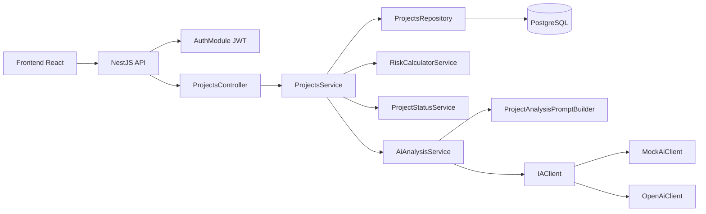

# Gestão Simplificada de Projetos

Sistema full stack para autenticação, cadastro, consulta, edição, remoção e análise inteligente de projetos.

## Tecnologias

- React, Vite, TypeScript, React Router, TanStack Query, React Hook Form, Zod e Axios.
- NestJS, TypeScript, Prisma, PostgreSQL, class-validator, Swagger/OpenAPI e Jest.
- Docker, Docker Compose, Nginx, ESLint, Prettier e GitHub Actions.

## Arquitetura



## Como rodar com Docker

```bash
docker compose up --build
```

- Frontend: http://localhost:5173
- Backend: http://localhost:3000
- Swagger: http://localhost:3000/api/docs
- PostgreSQL: localhost:5432

Healthcheck:

```bash
curl http://localhost:3000/health
```

## Como rodar localmente sem Docker

Backend:

```bash
cd backend
cp .env.example .env
npm install
npx prisma migrate dev
npm run start:dev
```

Frontend:

```bash
cd frontend
cp .env.example .env
npm install
npm run dev
```

## Variáveis de ambiente

Backend:

- `DATABASE_URL`: conexão PostgreSQL.
- `PORT`: porta da API.
- `AI_PROVIDER`: `mock` ou `openai`.
- `OPENAI_API_KEY`: chave para integração real com OpenAI.
- `FRONTEND_URL`: origem liberada no CORS.
- `JWT_SECRET`: segredo usado para assinar tokens JWT.

Frontend:

- `VITE_API_URL`: URL base da API.

## Endpoints principais

- `POST /auth/register`
- `POST /auth/login`
- `GET /auth/me`
- `GET /health`
- `POST /projects`
- `GET /projects`
- `GET /projects/:id`
- `PATCH /projects/:id`
- `DELETE /projects/:id`
- `PATCH /projects/:id/status`
- `GET /projects/:id/ai-analysis`

## Regras de negócio

- Todo projeto nasce com status `ANALYSIS`.
- Transições permitidas: `ANALYSIS -> APPROVED`, `APPROVED -> IN_PROGRESS`, `IN_PROGRESS -> FINISHED`.
- Qualquer status pode ser alterado para `CANCELLED`.
- Não é permitido pular etapas.
- Projetos `IN_PROGRESS` ou `FINISHED` não podem ser excluídos.
- O risco é recalculado ao criar ou alterar orçamento, data inicial ou data final.
- O maior risco prevalece quando mais de uma regra se aplica.
- Endpoints de projetos exigem autenticação JWT.

## Decisões técnicas

- Controllers não possuem regra de negócio.
- Autenticação usa JWT e senha com hash `bcrypt`.
- O repository concentra acesso ao Prisma.
- Regras de risco e status ficam em serviços dedicados e testáveis.
- A análise de IA depende de uma interface, permitindo trocar mock por OpenAI sem alterar controller ou regra de negócio.
- O frontend centraliza chamadas HTTP em `project.service.ts` e usa hooks para cache e mutações.

## Melhorias futuras

- Perfis de usuário e autorização por papel.
- Paginação e filtros avançados.
- Auditoria de mudanças de status.
- Testes end-to-end.
- Deploy automatizado.

## Comandos úteis

Backend:

```bash
npm install
npm run start:dev
npm run test
npm run lint
npx prisma migrate dev
npx prisma studio
```

Frontend:

```bash
npm install
npm run dev
npm run build
npm run lint
```

## Deploy em produção

Arquivos principais:

- `docker-compose.prod.yml`
- `.env.production.example`
- `backend/Dockerfile.prod`
- `frontend/Dockerfile.prod`
- `frontend/nginx.conf`
- `DEPLOYMENT.md`

Fluxo resumido na VPS:

```bash
git clone git@github.com:SEU_USUARIO/SEU_REPOSITORIO.git
cd SEU_REPOSITORIO
cp .env.production.example .env.production
docker compose --env-file .env.production -f docker-compose.prod.yml up --build -d
```

Leia [DEPLOYMENT.md](./DEPLOYMENT.md) para o passo a passo completo com proxy reverso, logs, atualização e backup.
